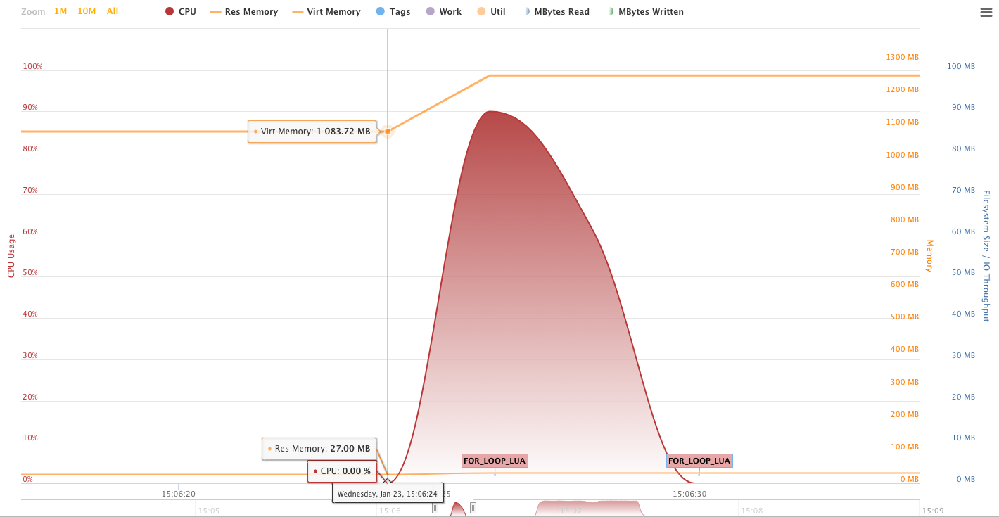
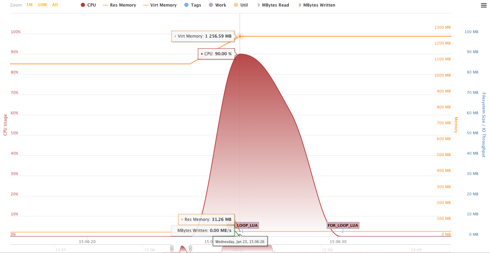
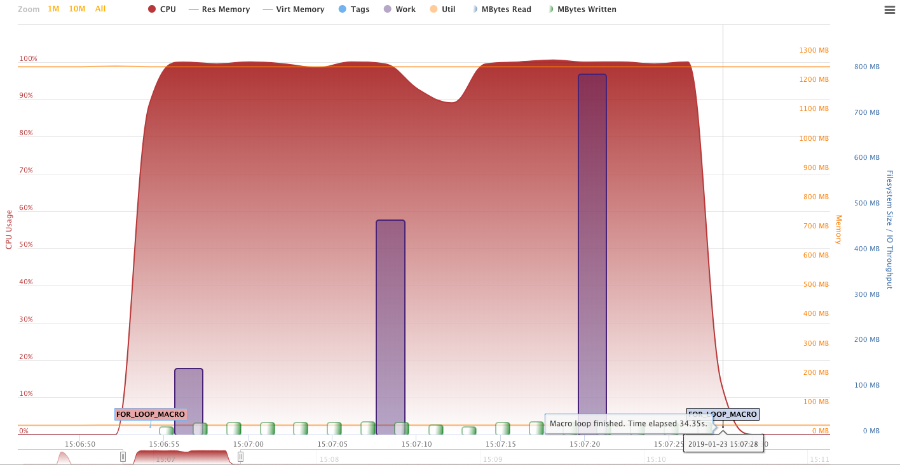
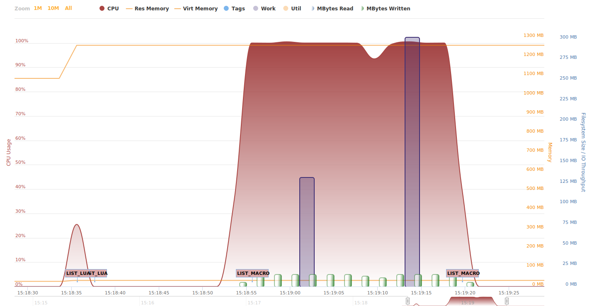
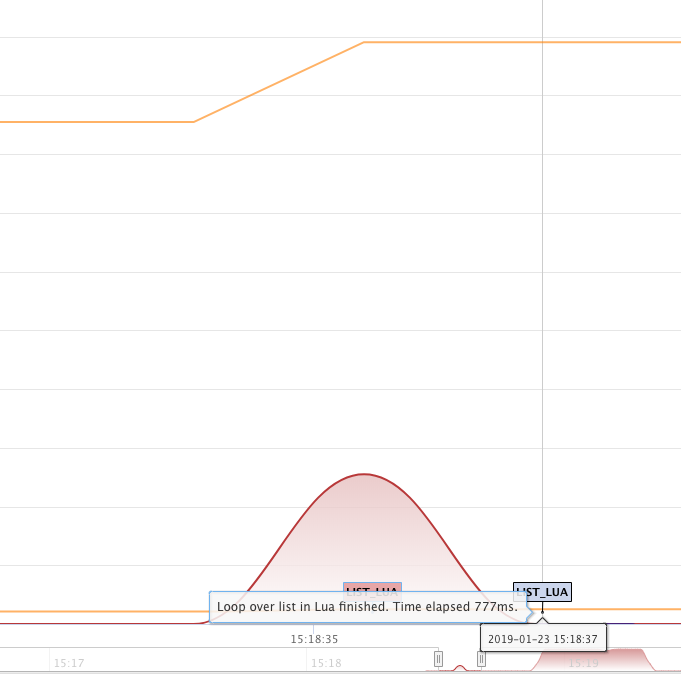
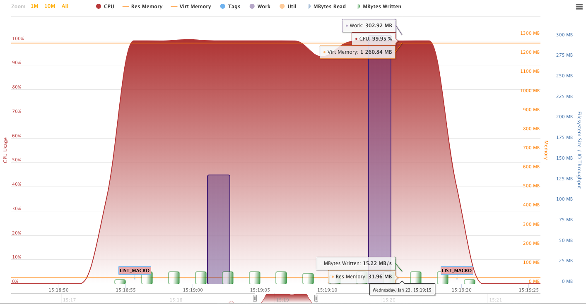
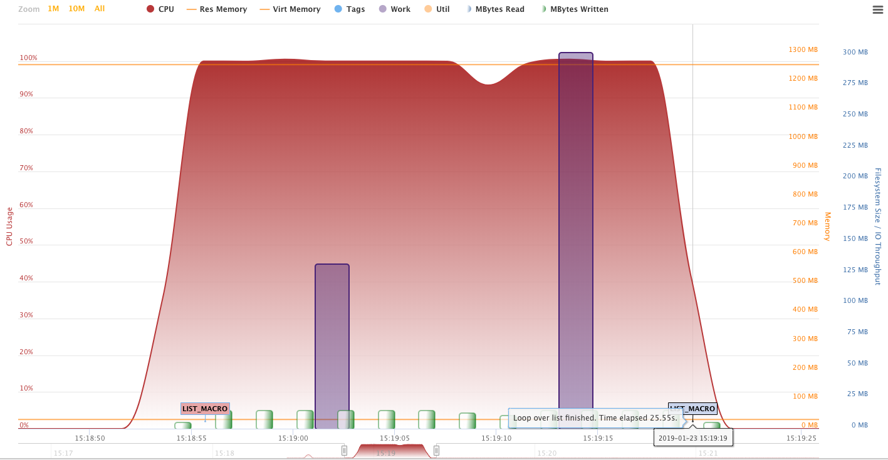
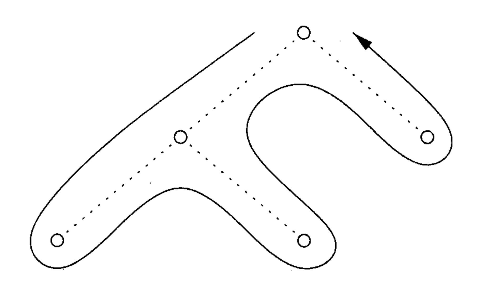

# What is Lua?

---

- Introduced in SAS 9.4M3
- Lua is a lightweight scripting language designed primarily for embedded use in applications. Written in C.
- Comparing to alternatives (like PROC GROOVY) has much less overhead and is easier to use.

---

```
ERROR: SUBMIT block:2: attempt to call a table value
stack traceback:
    SUBMIT block:2: in function 'iterate'
    SUBMIT block:9: in function 'times'
    SUBMIT block:13: in main chunk
ERROR: There was an error submitting the provided code
NOTE: The SAS System stopped processing this step because of errors.
```

---

```
ERROR: An unexpected semicolon occurred in the %DO statement. A dummy macro will be compiled.
```

# Lua vs SAS Macro performance

## Intro

- Visual performance overview using [Enterprise Session Monitor](https://boemskats.com/esm/) (ESM) for SAS — software by Boemska 
- Performance monitoring can be also obtained in SAS with [Application Response Measurement](http://support.sas.com/documentation/cdl/en/armref/64756/HTML/default/viewer.htm#p0ea993lrwm83nn1tih7b9wsdxmr.htm) (ARM) 

# For loop

## For loop (n=1e7)

:::::::::::::: {.columns}
::: {.column width="50%"}

```sas
%do i = 1 %to &n;
  %put &i;
%end;
```
:::
::: {.column width="50%"}

```sas
for i = 1, n do
  print(i)
end
```
:::
::::::::::::::

---

###### For loop -- overview

{ style="background:none; border:none; box-shadow:none;" }

---

###### For loop -- Lua

{ style="background:none; border:none; box-shadow:none;" }

---

{ style="background:none; border:none; box-shadow:none;" }

---

{ style="background:none; border:none; box-shadow:none;" }

---

###### For loop -- SAS Macro

{ style="background:none; border:none; box-shadow:none;" }

---

{ style="background:none; border:none; box-shadow:none;" }

---

{ style="background:none; border:none; box-shadow:none;" }

---

###### Utility files in WORK

```
$ ls -al
-rw-r--r-- 1 sasdemo 88039424 Oct 20 19:57 #tf0024.sas7butl
drwx------ 2 sasdemo     1024 Oct 20 19:57 .
drwx------ 3 sasdemo       96 Oct 20 19:56 ..
-rw-r--r-- 1 sasdemo    12288 Oct 20 19:57 sasmac1.sas7bcat
```

# Iteration over a list

## Iterating over a list (n=1e5)

:::::::::::::: {.columns}
::: {.column width="50%"}

```sas
%let list=George Paul Ringo John Foo Bar Baz Macro Polo;

%do i = 1 %to
  %sysfunc(countw(&list));

  %let item=%scan(&list, &i);
  %put &item;
%end;
```
:::
::: {.column width="50%"}

```sas
list = {"George", "Paul", "Ringo", "John", "Foo", "Bar", "Baz", "Macro", "Polo"}

for _, i in ipairs(list) do
  print(i)
end
```
:::
::::::::::::::

## Iterating over a list

{ style="background:none; border:none; box-shadow:none;" }

---

###### Iterating over a list -- Lua

{ height=600px style="background:none; border:none; box-shadow:none;" }

---

###### Iterating over a list -- SAS Macro

{ style="background:none; border:none; box-shadow:none;" }

---

{ style="background:none; border:none; box-shadow:none;" }

# Reading a dataset

## Reading a dataset (1900000 observations, 73mb, 5 variables)

```sas
data class(drop=i);
  set sashelp.class;
  do i = 1 to 100000;
    output;
  end;
  drop i;
run;
```

## Reading a dataset -- SAS Macro code

```sas
%let dsid = %sysfunc(open(&indat));
%syscall set(dsid);
%let nobs = %sysfunc(attrn(&dsid, nlobs));
%do i=1 %to &nobs;
  %let rc = %sysfunc(fetchobs(&dsid, &i));
%end;
%let rc = %sysfunc(close(&dsid));
```


## Reading a dataset -- Lua code

```lua
dsid = sas.open('class')
while sas.next(dsid) do
  name = sas.get_value(dsid, 'name')
  sex = sas.get_value(dsid, 'sex')
  age = sas.get_value(dsid, 'age')
  height = sas.get_value(dsid, 'height')
  weight = sas.get_value(dsid, 'weight')
end
sas.close(dsid)
```

## Reading a dataset -- overview

{ style="background:none; border:none; box-shadow:none;" }

# Migration

## Transpilers

- PROC DSTODS2 in SAS
- DATA Step is a SAS to C transpiler
- Typescript to Javascript
- C++ was a transpiler to C at the early development

## SAS Macro to Lua tranpiler 

```sas
/* mf_existds.sas */
/* @number */

%macro mf_existds(libds);
  %if %sysfunc(exist(&libds))      ne 1 &
      %sysfunc(exist(&libds,VIEW)) ne 1 %then 0;

  %else 1;
%mend;

%put {%mf_existds(sashelp.class)};
```

---

## Lua equivalent

```lua
-- mf_existds.lua

function mf_existds(libds)
  if sas.exist(libds) ~= 1 and 
     sas.exist(libds, 'VIEW') ~= 1 then

    return 0
  else
    return 1
  end
end

print('{'..mf_existds('sashelp.class')..'}')
```

## ANTLR

Demo

## Tree traversal



---

###### Sasensei quizz (Lua, SAS Macro, regex questions)

<https://sasensei.com/test/131>

{ height=500px style="background:none; border:none; box-shadow:none;" }


<!--
ERROR: SUBMIT block:2: attempt to call a table value
stack traceback:
    SUBMIT block:2: in function 'iterate'
    SUBMIT block:9: in function 'times'
    SUBMIT block:13: in main chunk
ERROR: There was an error submitting the provided code
NOTE: The SAS System stopped processing this step because of errors.


- [ ] why lua
- [x] inspire by showing a simple example
- [ ] reading a dataset
- [ ] libraries developed, math.huge
- [x] difference
- [ ] Rowland methods
- [ ] & is a lava and proc lua example from allan
- [ ] speech about value of migration??? histers?
- [x] intro to transpilers
- [x] ds2ds2 example
- [x] demo

 -Dragon book p 57 Figure 2.12

asd
asd
a
sds
-->

